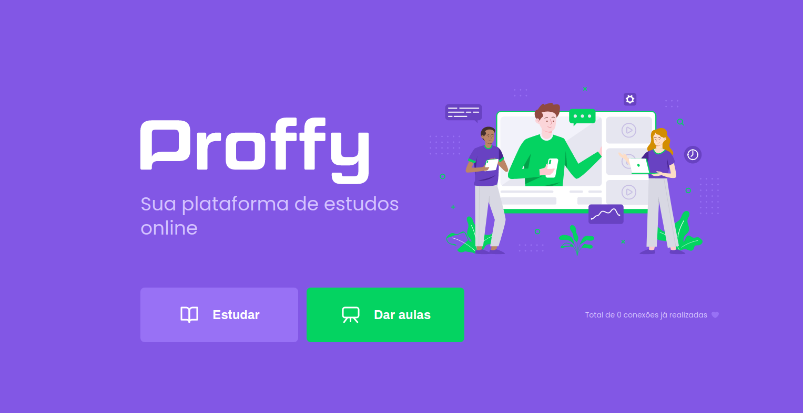

<p align="center">  
[](https://www.linkedin.com/in/filipelbatista/) 
&nbsp;
[](mailto:filipe.x2016@gmail.com)
</p>

<hr/>

<h1>
    
</h1>

# Indice

- [Sobre](#-sobre)
- [Como baixar o projeto](#-como-baixar-o-projeto)

## 🔖&nbsp; Sobre

Projeto desenvolvido durante a Next Level Week 2, da <a target="_blank" href="https://rocketseat.com.br">Rocketseat

---

---

## 🗂 Como baixar o projeto

```bash

    # Clonar o repositório
    $ git clone https://github.com/modernfunkboss/nlw2-proffy-omnistack.git

    # Entrar no diretório desejado
    $ cd web
    ou
    $ cd mobile
    ou
    $ cd server

    # Instalar as dependências
    $ yarn install

    # Iniciar o projeto
    $ yarn start
```

---

<p align="center">Desenvolvido 💜 por Filipe Batista</p>
